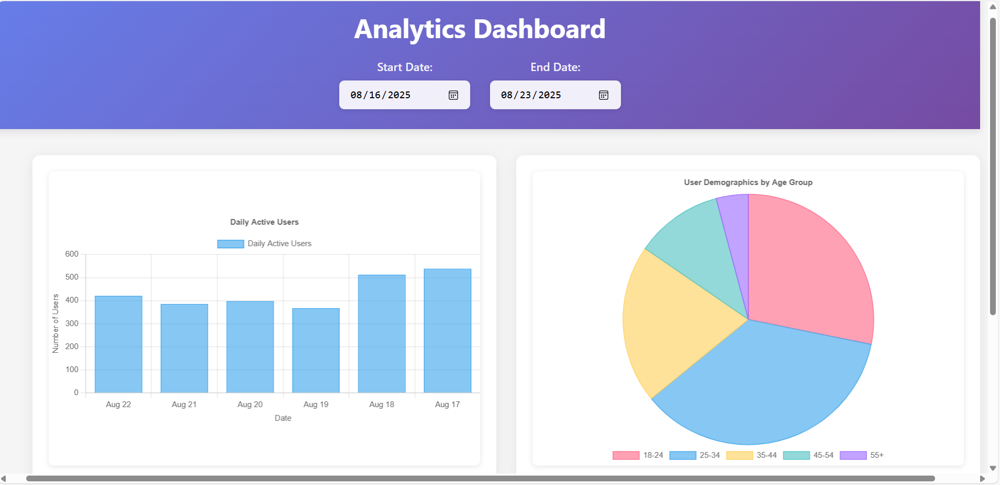

# Analytics Dashboard

A responsive React dashboard showing analytics data with interactive charts and date filtering.

## Features

- 📊 Bar chart showing daily active users
- 🥧 Pie chart showing user demographics
- 📅 Date range filter
- 📱 Fully responsive design
- 🐳 Docker container support

## Technologies Used
- React 19 with TypeScript
- Chart.js with react-chartjs-2
- CSS Grid and Flexbox for responsive layout
- Docker for containerization

## Prerequisites

- Node.js 16+ and npm
- Docker (optional, for container deployment)

## Installation and Running

### Method 1: Using npm

1. Clone the repository:
```bash
git clone https://github.com/yasmineldiasty/analytics-dashboard.git
```

```bash
cd analytics-dashboard
```

2. Install Dependencies:
```bash
npm install
```

3. Start Development Server
```bash
npm run dev
```

4. Access the Application
Open your browser and navigate to: http://localhost:5173


### Method 2: Using Docker
Open Docker Desktop App in the Background

1. Clone the repository:
```bash
git clone https://github.com/yasmineldiasty/analytics-dashboard.git
```

```bash
cd analytics-dashboard
```

2. Build Docker Image
```bash
docker build -t analytics-dashboard .
```
3. Run Docker Container
```bash
docker run -p 3000:80 analytics-dashboard
```
```bash
docker run -d -p 3000:80 --name analytics-app analytics-dashboard
```

4. Access the Application
Open your browser and navigate to: http://localhost:3000


### Screenshot of the Dashboard 



### To run on the Mobile :
After the above steps , Scan the appeared QR Code with an Android Mobile 

Run this command if it doesn't appear :
```bash
npm run dev -- --host 0.0.0.0 --port 5173
```
